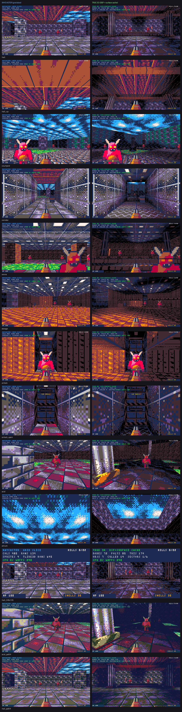
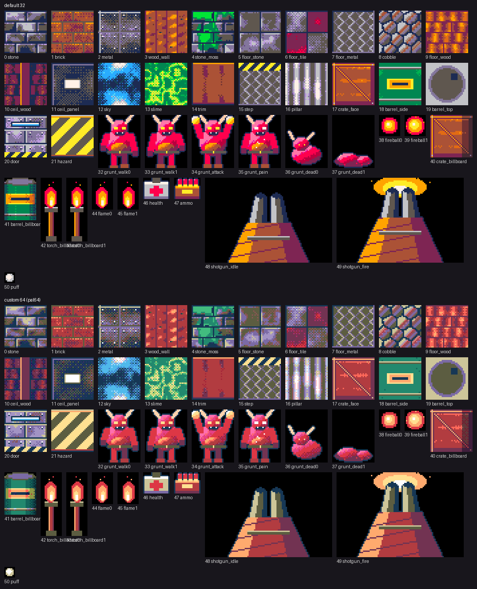

# FPS Render Lab - raycaster vs. true 3D in Picotron

`carts/fps-render-lab.p64` is a small shooter with **two renderers for one
level**. Press **TAB** in game to flip between them live:

| | RAYCASTER (`ray.lua`) | TRUE 3D (`bsp.lua`) |
| --- | --- | --- |
| school | Wolfenstein 3D / early Doom | Quake |
| world | 64u grid sliced out of the map at eye height | CSG'd brush polygons in a BSP tree |
| floors / ceilings | one height each (0 / 128), per-cell textures | anything: stairs, dais, platform, pool, bridge over the arena |
| walls | whole grid cells (a 32u pillar becomes a 64u block) | exact brushes, incl. sloped braces |
| look up/down | y-shear (horizon moves; verticals stay vertical) | real pitch |
| lighting | per-cell light on walls + distance fog | baked lightmaps (16u samples, bilinear + dithered) in a surface cache + fog |
| props | billboards | real meshes (crate, 8-sided barrel, torch stand) |
| occlusion | 1D z-buffer per column | BSP back-to-front (painter's that is always right) |
| cost scales with | screen width (480 DDA rays) | visible polygons |
| collision | grid cells, z = 0 | brush boxes, step-up 20u, gravity |
| doors | Wolfenstein door cells: ray tested against the panel mid-cell | sliding boxes clipped to the doorway |
| hidden areas | free: the DDA stops at the first wall/door | precomputed PVS per 64u cell + sectors behind closed doors, one bit test per BSP node |
| sky / acid | scrolling textures on per-cell ceiling/floor tiles | scrolling, unlit, wrapped textures on any polygon (the sunroof, the pools) |

A start menu picks the renderer (up/down + Z, or click; the level spins
behind it, drawn by the highlighted renderer). Controls: WASD move, click to
lock the mouse (or arrows) to look, click / Z / space to fire, TAB switch
renderer, M back to the menu, V detail (480x270 / 240x135), H show/hide the
renderer stats (hidden by default: only the gameplay HUD shows), G switch
palette + art set (default 32 colours / custom 64), 1-9 warp to the
comparison viewpoints, R restart. 22 grunts, shotgun hitscan, health/shell
pickups.

The level: the original west complex (great hall, arena, courtyard with an
acid pool, storage) plus an east wing behind **airlocks** - tunnels with a
sliding door at each end: an **acid works** (two scrolling acid channels,
bridges, pillars, a pipe gantry) and a **sun atrium** with a sunroof open to
a scrolling sky. Three airlocks join them, one looping back to the
courtyard. Doors open when you (or a chasing grunt) come near.



*Frames rendered by `tools/fps-lab/screenshots.py`, i.e. the real cart Lua
running in the software mock (see "Verification" below), not captured from
Picotron itself.*

## Level pipeline: TrenchBroom -> BSP

```
tools/fps-lab/gen_level.py   (one-time seed)  -> carts/fps-render-lab.map
TrenchBroom (edit)                              carts/fps-render-lab.map
tools/fps-lab/map2bsp.py                      -> carts/fps-render-lab.p64/level.lua
```

`map2bsp.py` is a pocket version of id's qbsp + light:

1. parse Standard or Valve220 `.map`, planes from the 3-point form
2. brush faces -> convex polygons
3. **CSG**: chop every face against every other brush, drop what is buried
4. **outside fill**: voxelise, flood from `info_player_start`, drop faces
   that look into the void (and stop with `LEAK` if the map isn't sealed)
5. **sectors**: `func_door` brushes are doors, not world. The open space is
   flood-filled again with the doors shut; each connected area is a sector
   (6 here) and each door records the two sectors it joins
6. coplanar faces with the same material are re-merged into big rectangles
   (625 polygons for this map); each becomes a **surface** whose lightmap is
   baked from `light` entities (and torches) with voxel shadow rays: one
   sample every 16u, stored in 1/8ths of a shade level. Sky and slime are
   "turbulent": no lightmap, drawn from their scrolling texture
7. polygon **BSP**: while a node mixes sectors, planes that separate them win;
   then fewest splits (heavily weighted), balanced, axial preferred: 656
   polys, 313 nodes, depth 16. Every node stores the bitmask of sectors in
   its subtree
8. the raycaster's grid: a cell is a wall if brushes cover the z 30..62 band
   at its centre; per-side wall textures, per-cell floor/ceiling textures,
   light and sector; door cells; plus collision boxes and entities
9. **PVS** (Quake's potentially visible set): for every 64u cell, which BSP
   nodes, polygons and cells can be seen from anywhere inside it. A 2D map
   of 16u columns that are solid from z 8 to 184 (walls, full-height
   pillars) is the occluder; 2048-ray fans from 9 sample points per cell
   mark the columns they reach; a polygon is visible if a reached column is
   within 16u of it. Each cell's set is unioned with its 8 neighbours' so an
   eye anywhere in the cell never loses a sliver. Doors count as open (the
   runtime sector flood handles closed ones). ~218 of 656 polygons per cell,
   stored as hex bit strings in level.lua (~600 KB, decoded per cell on
   entry)

Run it after editing the map (about 3.5 minutes, 1.5 of them the PVS):

```sh
python3 tools/fps-lab/map2bsp.py
```

### Editing in TrenchBroom

1. Copy `tools/fps-lab/trenchbroom/` into TrenchBroom's `games/` folder as
   `FPSLab/` (Linux `~/.TrenchBroom/games`, Windows
   `%AppData%\TrenchBroom\games`, macOS
   `~/Library/Application Support/TrenchBroom/games`). The config is game
   config **version 9** (TrenchBroom 2024.1+).
2. Preferences -> Picotron FPS Lab -> Game path = that same folder (it holds
   `textures/fpslab/*.png`).
3. Open `carts/fps-render-lab.map`. Entities: `info_player_start`, `light`,
   `monster_grunt`, `prop_crate`, `prop_barrel`, `prop_torch`,
   `item_health`, `item_ammo`, and the brush entity `func_door` (`angle` =
   slide direction; it slides its own width into the wall). See
   `fpslab.fgd`.

Doors that should split the level into sectors must seal their opening (a
gap around a door makes both sides one sector). Make a door's tunnel one
grid cell wide with the panel across the middle of a cell so the raycaster
can treat that cell as a door cell. Sky faces use texture scale 8 (one
32px tile per 256u).

Keep brushes on the 16u grid where you can: that is what lets the compiler
merge faces into big rectangles. Collision uses brush **bounding boxes**, so
keep anything the player can touch axis-aligned (sloped detail up high, like
the hall's braces, is fine).

## PVS, batch prepass and memmap: the 60 fps pass

Measured in the mock, most polygons the BSP walk drew were painted over:
corridor 122 drawn / 24 with a final pixel, arena 67 / 21, storage 85 / 31.
Three changes took the true-3D renderer to 60 fps in every benchmark pose
at 240x135 (and 7 of 9 at 480x270):

1. **PVS** (see the pipeline): the walk skips any node or polygon the
   player's cell can't see, and objects in cells it can't see. Corridor
   122 -> 71 polygons processed, arena 67 -> 37.
2. **Batch prepass** (`bsp.lua` `batch_frame`). Every level polygon is a
   quad, so all per-polygon and per-node setup runs as a few dozen userdata
   ops over all 656 quads / 313 nodes (Picotron charges ~1 cycle per 24
   elements, against ~2 cycles per Lua instruction):
   * `Sud:take(VIDX, Q, ...)` gathers every quad's 4 projected verts in one
     call; two strided `mul`s premultiply u, v by w
   * 24 strided `min`/`max` ops give each quad its screen bbox and w range
     (near-plane test); `sub`/`mul`/`add`/`pow` give its fog distance
   * node frustum culling is ONE `matmul`: node boxes (NN x 6) times a 6x4
     matrix whose column k puts plane k's normal on the box corner furthest
     along it; minus normal.eye, min over the 4 planes (4 strided ops) <
     0 means outside
   * one more `matmul` gives the eye side of every splitting plane
   The walk then does one `get` of 7 values per quad and a couple of
   userdata reads per node. Great hall, mock instructions per frame:
   114k -> 82k.
3. **`memmap` for fog**: a fog level is a 16k userdata holding all 4 light
   tables; switching maps it over 0x8000 instead of copying it, so
   polygons and objects use their exact fog level (no hysteresis needed).

Correctness check: `PVS_ON = false` renders as if every cell saw
everything; at 1434 random standing poses the PVS frame matches that
pixel for pixel in all but one, which differs by a single seam pixel.

## Sectors and doors

Each frame the true-3D renderer floods the **visible sector set** out from
the player's sector through every door that is open *and* inside the view
frustum. A BSP node whose sector bitmask misses that set is skipped with
its whole subtree (its objects too), so a sector behind a closed airlock
costs one test. Standing in an airlock with both doors shut the view drops
to ~35k Lua instructions (vs ~110k in the great hall).

Doors are shared by both renderers and both physics models:
`world.lua` animates them (open when the player or a chasing grunt is
near, stay open while anyone stands in the doorway), moves a collision box
for the 3D physics and makes the door cell solid for the grid physics
until it is 70% open. The raycaster treats a door cell like Wolfenstein:
the ray is tested against the panel half a cell in and passes the part
that has slid away; the BSP draws the panel as a box clipped to the
doorway, so it never overlaps the wall it slides into.

## Palettes: default 32 vs custom 64 (G)

Picotron has 32 colours by default and can define 64. The cart carries two
art sets and switches between them with **G**: Picotron's default 32-colour
palette (`sprites/`) and a custom 64-colour palette
(`sprites/pal64/`, sprite index + 64, palette in `sprites/pal64/palette.hex`).

Shading works for any palette because it no longer uses palette ramps:

* a texel is `colour + 64 * light level` (levels 0..3)
* the read mask (`0x5508 = 0xff`) makes those top bits select one of
  Picotron's 4 colour tables; table k maps every colour to the palette
  colour nearest to it at `SHADE[k]` brightness (`gfx.lua`)
* distance fog swaps all 4 tables for ones shifted f levels darker:
  `memmap()` of a prebuilt 16k userdata at 0x8000, so swaps are free
* HUD/menu colours are PICO-8 numbers mapped to the nearest colour of the
  active palette (`UI[c]`)

`tools/fps-lab/gen_art.py` designs everything once with smooth ramps and
smooth shading, then quantises it (ordered dither on the in-between
colours) into both palettes. `tools/picotron/png2gfx.lua` switches the
display palette to a folder's `palette.hex` while it reads that folder's
PNGs, so both sets bake to the right indices. To try another palette,
replace the colours in `palette.hex`, `PALETTES` in `gfx.lua`, `PAL64` in
`gen_art.py` / `screenshots.py`, and rerun `gen_art.py`.



## Picotron techniques used (the "maximum optimisation" list)

- **Batched `tline3d`**: a userdata of args, one Lua->C call. The raycaster
  draws every wall column (≈960 textured lines) in *one* call, and every
  billboard column in one more. The polygon filler (`fill_poly`, grown from
  ld58-pictoron-3d-engine's `textri`) walks a convex polygon's two edge
  chains, expands each span's scanlines in C (`copy` + prefix-sum `add`) and
  draws the whole polygon with one batched `tline3d` - no triangle fan.
- **`matmul3d` batch transform**: every level vertex goes to camera space in
  one call per frame; Lua only reads the vertices of polygons it draws.
- **Surface cache** (Quake's trick): lightmaps are baked into per-surface
  textures at load (~1.8M texels). Per surface, the light samples go into an
  f64 field, `userdata:lerp` fills it in bilinearly (one call per sample row,
  one per row pair), a 4x4 Bayer threshold is added with one strided `add`
  per dither row, and `convert("u8")` floors it to a shade level that is
  added as `16*level`. So the 4 palette ramps fade smoothly instead of
  stepping in 16u squares. Lighting then costs *nothing* per frame and
  doesn't split geometry.
- **Colour-table light levels**: "darker by k" is just `+64*k` on a texel
  (the top bits pick a colour table, see "Palettes"). Distance fog maps a
  prebuilt set of 4 tables over 0x8000 with `memmap` (no copy); sprites use
  pre-shaded copies so shading can vary *inside* a batch call.
- **PVS + batch prepass**: see "PVS, batch prepass and memmap" above.
- **Scrolling sky/acid**: 4 wrapping `blit`s per shade variant per frame
  scroll the textures in place; the raycaster's floor/ceiling maps and the
  BSP's wrapped (`0x5534` loop mask) turbulent polygons both pick it up.
- **Map-mode `tline3d` for raycaster floors/ceilings**: each screen row is a
  line of constant depth, drawn from an i16 map of pre-shaded tiles, so
  every cell gets its own floor texture and wrapping is free.
- **BSP back-to-front + frustum-culled node boxes**: no z-buffer, no sort;
  monsters/props are dropped into the BSP leaf they stand in so they sort
  against walls correctly.
- No `table.sort` in Picotron - small insertion sorts only where needed.

## Frame-rate targets (30-60 fps)

`_draw()` runs at 60 fps, or drops to 30/20/15 when a frame blows the budget
(`stat(7)`); `stat(1)` is the share of a 60 fps frame used. Levers, in order
of impact:

- **Detail mode** (`V`, or AUTO): `vid(3)` renders at 240x135 and the display
  doubles it - 1/4 of the fill, half the raycaster columns and BSP
  scanlines. AUTO starts at 480x270 and drops to 240x135 if Picotron runs
  `_draw` below 60 fps for ~2 s. The weapon/HUD rescale.
- **Object frustum culling + mesh LOD**: props, monsters and items outside
  the view cost nothing; props past 560u draw as their billboard (one
  `sspr`) instead of a mesh.
- **Batched projection**: after the one `matmul3d`, 9 strided userdata ops
  compute `1/z` and screen x/y for every vertex in C; Lua only touches
  vertices when a polygon crosses the near plane.
- Raycaster: per-frame locals, inlined fog, one batch for all walls.

### Real Picotron numbers

CI runs `tools/fps-lab/picotron_bench.lua` inside headless Picotron (step
"Benchmark FPS Render Lab" -> job summary): every renderer x pose x detail
level, 40 frames each, reporting mean `stat(1)` and `stat(7)`. Treat CI
runner numbers as relative; the in-game readout (cpu %, fps, 480/240) is the
truth on your machine.

40 frames per pose; `stat(1)` reads 0 inside a headless `-x` script, so fps
comes from `stat(7)` and `time()` (666 ms = 60 fps, 1333 ms = 30 fps):

| | raycaster | true 3D |
| --- | --- | --- |
| 480x270, first pass | 20-30 fps | 30 fps (arena ~37) |
| 240x135, first pass | 60 in 3 of 6 poses, else 30 | 60 in 4 of 6 poses, else 30 |
| **480x270, second pass** | **30 fps in all 6 poses** | **60 fps in 4 of 6, 30 in hall + corridor** |
| 240x135, second pass | 60 fps in all 6 poses | 60 fps in all 6 poses |
| **480x270, bigger level** (9 poses) | **30 fps in all 9** | **60 in airlock + atrium, else 30** |
| 240x135, bigger level (9 poses) | 60 fps in all 9 | 60 in 5 of 9 (airlock, arena, atrium, courtyard, hall up), hall ~45, 30 in acid works, corridor, storage |
| **480x270, PVS + batch prepass** | **30 fps in all 9** | **60 in 7 of 9, hall ~48, acid works 30** |
| **240x135, PVS + batch prepass** | **60 fps in all 9** | **60 fps in all 9** |

Those runs lined up with the mock: frames under ~130k mock instructions
(`_update` + `_draw`, 240x135) held 60 fps, frames above it dropped to 30.

### Third pass: the bigger level

The east wing roughly doubled the level (625 surfaces, 22 grunts, 82
things). What it cost and what bought it back, in mock instructions per
frame in the great hall at 240x135:

- grunts: each move scanned every solid prop -> props live in a 128u bucket
  grid (`_update` 32k -> 12k)
- colour-table fog: each switch now copies 16k (4 tables) -> hysteresis on
  polygon fog and fog-relative object shading (18 -> 8 switches a frame;
  that was the difference between 30 and 60 fps in the courtyard)
- the BSP: tunnel planes split the hall into more fragments -> splits
  weighted 14 instead of 6 and sector-separating planes first (draw 125k
  -> 106k)
- the raycaster: ~90 things to sort -> only sprites on screen and not
  behind a wall at their left, centre and right column are sorted
- sectors: in the new areas, everything behind closed doors is skipped

### Second pass

- raycaster DDA: the grid gets a solid border so the inner loop has no
  bounds checks and walks one flat cell index; wall/sprite batch rows are
  written with one `userdata:set()` each instead of 11 stores
- true 3D: `fill_poly` (one `tline3d` per polygon instead of 4 per quad),
  vertex fetch with `get(…, 3)`, near-plane test folded into the projected
  `w`, hierarchical frustum culling (children skip planes their parent box
  is fully inside)
- gameplay: monster line-of-sight re-checked every 8 frames (staggered),
  solid props in their own list, monster floor height only when it moved

### Mock profile (Lua VM instructions per frame, `_update` + `_draw`)

| pose | ray 240 | bsp 240 | ray 240 (before) | bsp 240 (before) |
| --- | --- | --- | --- | --- |
| hall | 79k | 116k | 136k | 152k |
| courtyard | 84k | 74k | 155k | 92k |
| corridor | 69k | 103k | 118k | 133k |
| arena | 89k | 68k | 148k | 81k |
| storage | 85k | 80k | 149k | 90k |

At 480x270 the raycaster is 114-148k and the true-3D renderer 55-106k
(`_draw` only). CI re-measures every push; see the job summary.

## Picotron 0.3 lessons (found in the real web player)

The first deployed build showed a black screen, which neither the mock nor
the headless benchmark could see. Loading the export in headless Chromium
with `printh()` breadcrumbs found two 0.3 behaviours:

- **Colour-table entries carry the 0xc0 table-select bits** (colour 7 is
  stored as 199). The fog tables remapped whole bytes and dropped those bits,
  which blanked every draw. Fix: remap only `v & 0x3f`, keep `v & 0xc0`.
- **`tline3d` loops non-power-of-two sprites**: the 32x40 grunt drew with
  its head repeated in the raycaster. Billboards are now padded into
  power-of-two canvases at load (`pad_pow2`, offsets in `SPR_OX/OY`).

CI now runs `scripts/picotron/browser-smoke.sh` on every export, and the
mock models the 0xc0 bits.

## Verification without Picotron

`tools/fps-lab/mock/picomock.lua` implements (in plain Lua 5.4) the Picotron
APIs the cart uses - userdata ops with offsets/strides/spans, `lerp`,
`convert`, `matmul3d`, `sort`, `peek`/`poke`/`poke2`, `blit`, batched and
map-mode `tline3d`, `sspr`, the 4 colour tables selected by the read mask -
and `mock/run.lua` runs the unmodified cart through it. `screenshots.py`
shoots every pose in both renderers (and two poses in the 64-colour set).

```sh
sudo apt-get install lua5.4 && pip install pillow numpy
python3 tools/fps-lab/screenshots.py /tmp/shots   # compare.png + report.tsv
```

Things the mock cannot prove: `tline3d` edge rules / sub-pixel seams and
real speed (the headless benchmark and the browser smoke test cover those).
The colour-table layout was read back from real Picotron 0.3:
`0x8000 + table * 0x1000 + draw_colour * 64 + target_colour`, colour-0 rows
pass the target through, opaque entries carry the 0xc0 bits.

## Files

```
carts/fps-render-lab.map            level source (TrenchBroom)
carts/fps-render-lab.png            gallery thumbnail
carts/fps-render-lab.p64/
  main.lua    game: menu, player, monsters, shotgun, pickups, HUD, keys
  gfx.lua     palettes, light/fog colour tables, shaded sprites, surface
              cache, scrolling textures, fill_poly
  ray.lua     raycaster
  bsp.lua     BSP renderer + mesh/billboard objects
  world.lua   collision (grid + boxes), doors, sectors, line of sight
  props.lua   crate / barrel / torch meshes
  level.lua   GENERATED by map2bsp.py
  sprites/    GENERATED by gen_art.py (hand-editable, index = filename):
              default-32 set; sprites/pal64/ = custom-64 set (+64)
tools/fps-lab/
  gen_level.py  seed .map (already run - edit the .map now)
  map2bsp.py    compiler (CSG, lightmaps, sectors, doors, BSP, grid)
  gen_art.py    textures, monsters, props, weapon in both palettes
                (+ --sheet contact sheet)
  screenshots.py, mock/   headless verification
  trenchbroom/  TrenchBroom game config, FGD, materials
```


